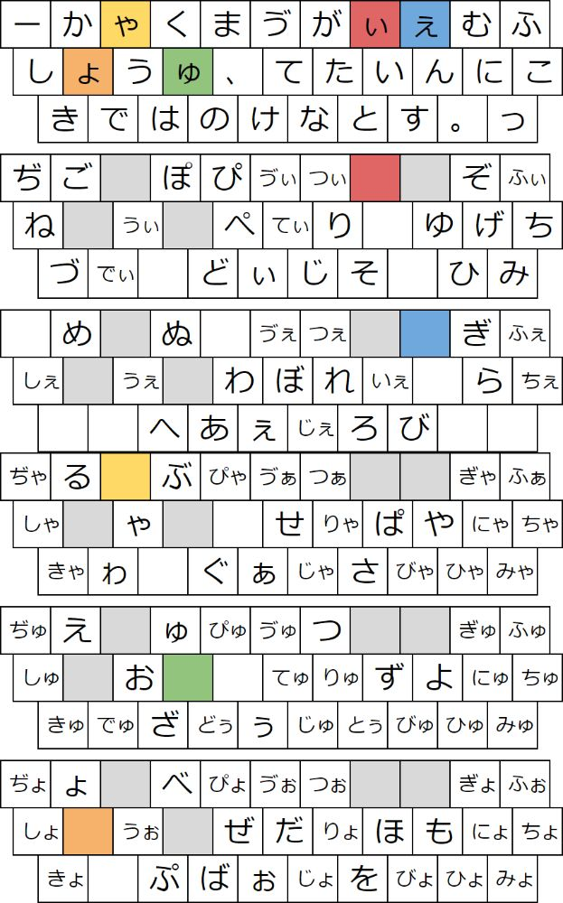

Alternative Typing Contest 2025で、一応優勝させていただきました。趣旨としてはあんまり早さを競うコンテストでは無くて、新配列見せてねというやつなんですが、まあ...

手を動かしたいという名前ででたのは良くなかったかもしれませんね。これはタイピングがしたいということじゃなくて、どちらかといえば解釈をしたがらず手を動かすという意味だったので私自身への戒めなんですが...

画像名が20220908.jpgということで、その時に考えたんだと思います。でも、当時は完成してから使って、やっぱり後置というかBS発行書き換えは無理だなあと思って(タイピングゲームで練習できないと難しい)、しばらく使わず、でもいつかgoogle日本語入力でやればいいというのは知っていたので、それでやって、自分で適当に覚えていきました。清濁別置ですが拗外音はキー共有があるので、まあまあそれなりじゃないですか。特に子音が普通にシフトなので、その位置も覚えやすくて良いと思います。ただ、最近良く見るようなてゃ(?)とか打てないんですけど。一時的な流行語と信じて...

というのでなんでこういう配列を作ったのかというか思想的な部分を解説します。

## 基本方針

- かな入力
- 清濁別置
- ハイブリッド月・月見草に感動していたので拗外音はキー共有
- 同時打鍵は無理なので順次打鍵
- 全ての拗外含めて2打で出す

これだけだと月見草と全く同じなんですが、月見草は一部キー共有の排他配置をしていないんですよね、たとえばrで「が」が普通は出るんですがシフト面が（ふぁふぉふょ」となっているとか(これは今公式サイトあるいはブログ的な部分だけで公開されているv2までじゃなくて[twitter(x)だけのv3でもそうなんですが](https://x.com/mentaik92877176/status/1448633456192208898/photo/1))、右小指外に「り」があるのにそのシフト面には「び」があるとか。これは嫌なので、原則的に1つのキーに1つの行段母音が割り当てられています。そのせいで、この配列は「び」がものすごく打ちにくいです。,oですからね。助けてください。でもそれをいうときょとかも結構ヤバいと思う。zsは普通に犯罪ではないか？かなり良くでてくるのに。

ハイブリッド月のように一部の濁音と半濁音はまあ別にそれくらいは覚えられる(それまでもそうしてきた)という経験があったので、そうした方が拗音のキー共有もうまいこと配置できるので、そうしました。

## 打鍵方向

中指収束理論を提唱しています。インナーロールでもアウターロールでも無く。中指に向かうほうがいいので、たとえばインナーロールだとkjの方がいいということになりますが私はjkの方が良いと思います。ほかにもアウターロールだとklの方が良いですが私はlkの方が良いと思います。それもあって後置シフトです。世の中の月配列はやっぱり2-263という巨人に屈してあるいはそこを考えるというのは複雑すぎて面倒くさいという理由で中指前置シフトが大変多いですが、これこそ私は一番疑うべきではないかと常々考えておりました。

## シフトキー

あとシフトキーが多いというの、具体的にはsefioにょゃゅぃぇを割り当てていて5シフトと普通の配列より非常に多いですが、これはまあまず行段ハイブリッドで普通に全ての拗外を網羅したいですよねという要請から必要だったということ、qwertyの考察として母音が5つあって頻度が分散されててそれが早さの秘訣なんじゃないかということ、単打面は減るがシフト面が増えますがこれによりシフト面の打ちやすい連接が増えることで結果的に遠くの一打より近くの二打がより促進されるんじゃないかということの検証の意味が多分に含まれています。個人的には遠くの一打を優先しがちだったんですが、これは結構効果を実感しています。ただ連接のことを考えるとやはりシフト動作というのはしんどいので、人間がやるもんじゃなくて計算によってやらせるべきことだという感想もまたでています。他にも、5シフトでちょうどいい感じに全ての拗外音が3段32キーに収まるというのもあります。しかし、今の配列は実はシフトキー→シフトキーという流れを許していなくて、結構いい感じのたとえばoiとかそういう連接が無いことになっている場合もまああるのかもしれないんですが、これってどうなんですか？たとえば、ゆゃみたいな文って打たないですよね。この辺を埋めてしまえばかなり使いやすくなるというのはそうなんですが、本来打ちたい流れがどこかで死んでしまう可能性というのが確か使っているときに見つかって、それで使っていないんですが、どうしたらいいんですかね...たとえばしょゃ絶対に打たないというのはわかってるんですが、ですが、ですが、...やっぱり次のは自分で詰めようと思います。今考えたのは、シフト→シフトと言う流れは、後置シフトと言う関係上、一度シフトを押すというのは確定動作であるため、そこからまた別のシフト面が展開されるというのは、つまり実質は3シフトになるということですか？これ間違ってるかな。あでもこれは多分後述の句読点キー共有の話と同じですね。すると2連打という打鍵をどう評価するのかという話になるんですが、そもそも2連打するというのは個人的にはかなり難しかった記憶があるんですが、どうだったんですっけ。忘れてしまいました。まあでもやると思います。月見草はガッツリ全部入ってるので。

そういうわけで結構シフトが多くて、本来的な打鍵数という観点で見るとかなり良くない側の配列と思っていいと思います。流石にローマ字とかよりは良いと思いますが。標準的な月系配列だとたとえば「る」は単打であることが多いと思いますが、この配列ではweですね。

っからのシフトについては、世の中の結構な砕けた文章で考えてみると普通にありえるものだったので、音韻論的にはありえないでしょうが、打つことがまだあると考えました。なので採用していません。以下に例を挙げます:

- がっがーん 雨降ってっがら 頭っがら皮がら内蔵まで 全部めっがーね。 客席がらっがら ふわっとろっが
- おっけーいっでっすか 本気っで思った ひっでーこと書いてんね あっでも
- エッジ バッジ
- ほっら えっらそうに あっらー えええっっらしゃい、
- かっるーい妄想入ってすいません すっるどおい やっるー
- あっまた美しくなった、あっまた色っぽくなった、 えっまだ続くの ほんっっまに勘弁してくれやー えっまさか
- っっっもうマジ嬉しすぎて涙が出る あっもちろん嬉しいですよ？ へっへっへっもし、目標に向けて グッモーニン
- なっなっんと、あの いやーっなどとは なっなんなんじゃこれは なっなんでもありません
- なんっにも考えとらんな 頑張らねばっにしても
- もっっっっっのすごくあめふってなかった たっのしいなあ
- ザッハトルテ おっはー はっはっはっは
- っん はR18ばっかりなのでtwitter(x)とかで探してください

これは[少納言](https://shonagon.ninjal.ac.jp)から取った結果なので、まあ結構厳しいのもありますけど、他にもtwitter(x)とかを見ればいくらでも用例なんてでてくるので、砕けた文章を排除するのはまあ違うと思うので採用していません。じゃあ「てゃ」とかもやれよ...という話になりますが、一時的な流行りだと考えているので...数十年生き残っていたら考えなくもない。

句読点のキー共有なんですが、やっていません。いやこれはかなり失敗というか、当時はこれって変換位置を自分で決めることができないのは思考の制限になるのではないか？と思って(今でも実際少しは思うことはありますが)採用しなかったんですが、明らかにそれを捨ててもいいくらいのことしか書くことないので、絶対にやったほうがいいです。ただでさえ5シフトのくせに句読点まで別置とか良くやったな。まあそれで慣れてるんですが...あと句読点の位置が標準からずれるとこれは逆にqwertyと混乱します。qwertyローマ字打ってるときに、を打とうとしてgを打って失敗することがかなり当初はありました。今はもう慣れたんでないですけど。とかいうことを書いてたんですが、これ後置シフトだと無理じゃないですか？と思ったけどシフト確定のための打鍵と、句読点打鍵で同じキーを2回押せばいいんですね。これだと句読点のいわゆる間というか、一旦打鍵が区切れるということの良い例になると思います。まあこれは一般的に打ちにくいとされる打鍵が発生してしまうことへの言い訳になってしまっているとも感じますが。

## 普通の人向けの配列

[大岡俊彦さんのブログのコメントにも書いたことですが、](http://oookaworks.seesaa.net/article/519009898.html#gsc.tab=0)種々の要素を鑑みた結果、私は静濁別置に慣れてしまったのでこのまま次もそうする予定ですが、ブリ中トロやハイブリッド月のカタログスペックだけを信じるなら、静濁同置+句読点のキー共有が結構な人々にとってちょうどいい記憶負荷と効率の配列なんじゃないかと考えています。あるいは月林檎(今回見てみたかった)とか、ぶな配列とか。いややっぱり別置は無理かな。単純に本当に1文字の頻度だけで行くならぶなが良いんだと思いますが、やっぱりqweで最大3打なのに4とか5とか嫌ですよね。それは本当にそう。今回2位ということで結構早かったですけど、それは私も過去の配列屋と同じように割り切ることができなかった。

> 月見草エキスは清濁別置でかなり複雑なので、
> 上級者しかお勧めできないかな。

まあ実は新下駄よりも負荷は軽いんですけどね。やっぱり別置は抵抗あるか。

## 漢直について

マジでかっこいい。早く作りたい。そのために機械学習とかAtCoder Heuristic Contestで焼きなまし法をやらなければならない。いや別にそんなことしなくてもいきなり作り始めても良いんでしょうけど、怠惰で自分の打鍵のどの連接が良いかということのデータを取っていません。データじゃなくても普通に自分で値を考えれば良いんでしょうけど、4連接とかなってくると死ぬじゃないですか。まあ仮に左右はそのまま加算ということで15(小指外で16)^4 + 17 ^ 4くらいの組み合わせがあるのは流石に考えきれない。多分行と段の指定で柔軟にやるとは思うんですが、それでも漏れが出てきてしまうと思うんですよね。なんとかならないものか。あと私一人がやりすぎるとやっぱり個人最適化されてしまって、いやまあ配列なんてそんな事を言ってしまえば全部そうするのが一番いいというのは周知のとおりなんですが、でもやっぱり連接データとして自分の文章じゃなくて一般的な文章を持ってくるからには打鍵データの方もそうしたほうがいいじゃないですか。新JISみたいにやりたい。いや無理だが。タイパーの方々からデータを集めるしかないのかなあ。それもqwertyローマじゃなくてtwoとかtyping(is)nonsenseとかで。

特に今考えているのはこれもブログコメントに書いたんですが全ての文字に対してシフト面を作るという案です。。たとえば貿のあとにはほぼ易が確定で来ますから、貿を打ったあとのシフト面には易を単打で打てるとうれしいですよね。易の配置は、通常易と打つ時の最後のキーに配置して、シフトを省略したと考えることができないのではないかと思っています。もちろん易についても易を打ったあとだけの固有シフト面が存在して、どんどんシフトをついでいく感じの。シフトキャンセルを押しやすい場所にしてやれば、それなりに記憶負荷が軽く、いい感じの効率になるかなと考えています。これしかも雪華の崩し字打鍵がそうなっているらしい。見に行ったらemacs lispと四角号碼で全く意味がわからなかったのですが、そのうち可視化して見てみたいと思います。

あとこれはあまりに打鍵数が多い漢直に対して考えたことなんですが、そうではなくて普通の清濁拗外小まで全部別置の配列とかでもいいんじゃないかと考えています。いや流石に意味ないかな。やっぱり普通のシフトとさほど変わらないか。

## ステノというかメジロ式について

いいですよね。すごく良いと思う。でも、やっぱり1つの指で複数のキーの間を打つように同時に打つというのは、これは無理じゃないですか？いややってくれているので別にできるんでしょうけど、でも難しいと思います。和音漢直とかならできると思うんですけどね。これは昔そういうのを考えていた人がやっぱりいたんですけど、その時も普通に打つのは無理だったという話がどっかであったような気がします。できれば最高なんですけどね...

でも実際この方向の、つまり1つのキー自体をもっと小さくして物理的に数を増やすというのは解決策としてはいつまでも考える必要があると思っていて、いやむしろ世の中の人々というか配列屋は減らす方向がどうしても多いと思うんですけど、でも単打が増えるということは純粋に効率上昇なんですから、考えてみるべきだと思います。新JISがあったのに世の中に普及しなかったというのもあるので私は物理配列を変えることに抵抗があるので。ploverって無くならないのかなあ。まあ大丈夫かなあ。
